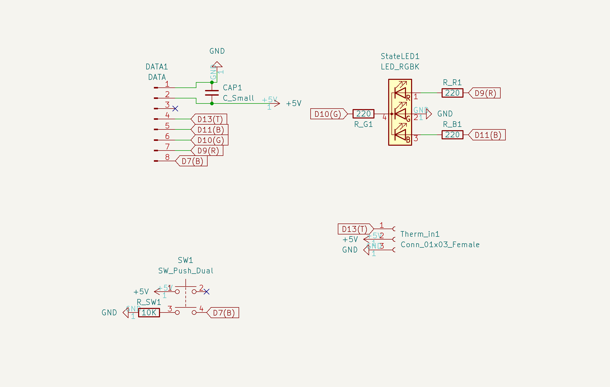
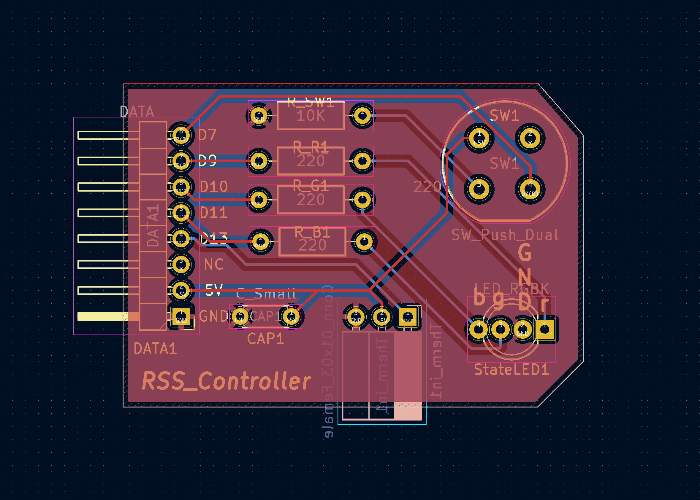
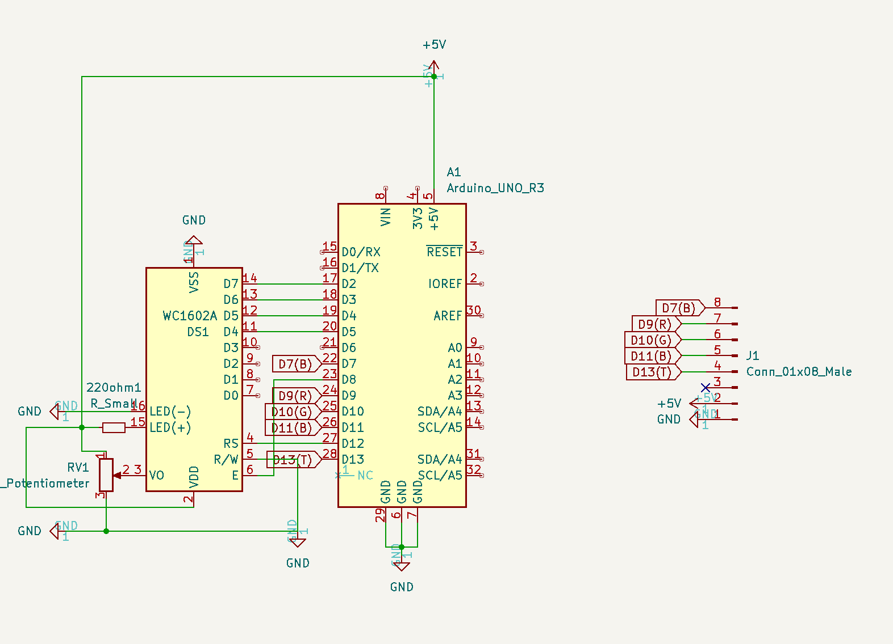
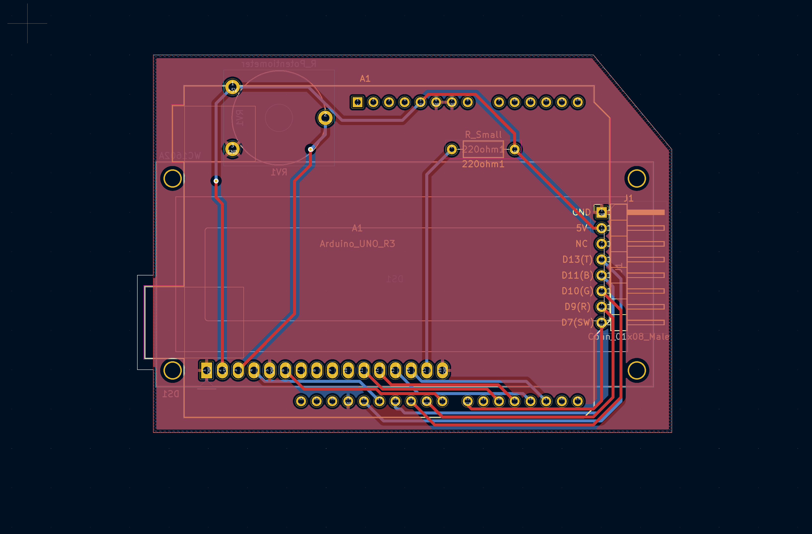

# RoomStateSensor-Management Schematics and PCB

## Explanation:
This project was made for one reason: to notify my rommmate about my availability. I built an easy circuit using Elegoo Uno and several sensors and  thought to present it to my teacher as an cplusplus project, which later on was declined as it is. Teacher, on the other hand suggested to add several features 
to it, so it would be acceptable for the particular course. 

## Features: 
### User side
- User has for states of a room: **Busy;Home;Come;Away** (Can be found in the [file](RoomyState/lcd.cpp))
- Each state is controllable with a **button** included in the circuit
- When the **button** is pressed, it communicates with a [**Counter class**](RoomyState/Counter.h), which has an overflow feature making it really scalable for more 
states added in future. 
- Indicator LED of a particular state for tail-end with a button
- Indicating the current tempreature and humidity
#### Schematics:  

#### PCB: 

### Reciever side:
- Shows the DATA on the 1602LCD
#### Schematics:  

#### PCB: 

#### Library usage: 
- [SerialPort](https://github.com/kleydon/Mac-SerialPort-Cpp/tree/master/*%20Project/MacSerialPort/SerialPort)
